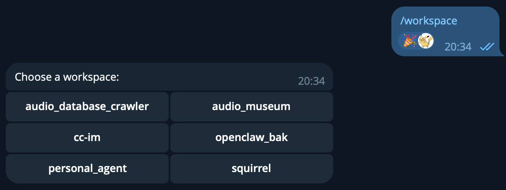
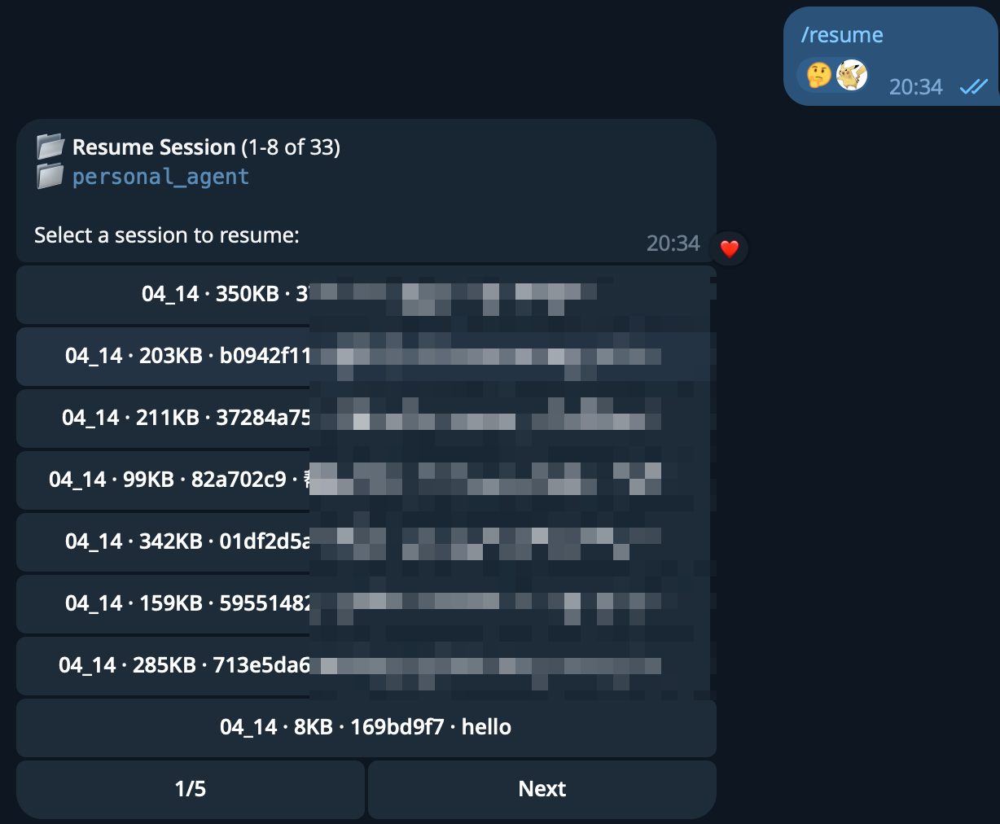
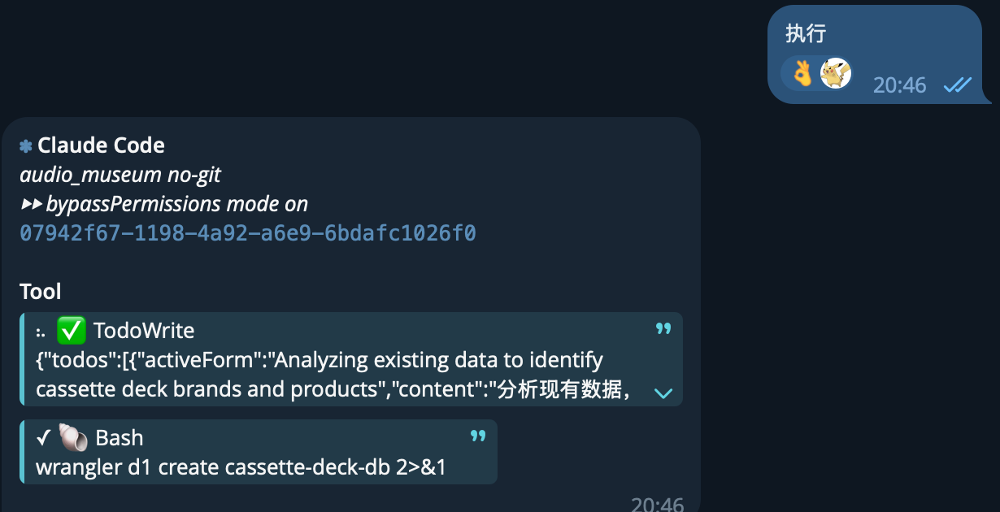

# cc-im

[中文 README](README.md)

Run local Claude Code or Codex CLI directly from Telegram.

## ✨ Why Use It

- Calls the native CLI directly, without an extra backend layer
- Switches into the target workspace before each run
- Streams tool activity and run status back to Telegram in real time

## 🖼️ Screenshots

### Workspace Picker



### Session Resume



### Tool Activity Streaming



## 🚀 Quick Start

Prerequisites:

- A Telegram bot token from [@BotFather](https://t.me/botfather)
- Claude Code or Codex CLI installed and authenticated
- Bun available on the host, or let the installer set it up

Recommended install:

```bash
curl -fsSL https://raw.githubusercontent.com/zhaofinger/cc-im/main/install.sh | bash
```

The installer will:

- install Bun when needed
- clone or update `~/.cc-im`
- guide `.env` setup
- install dependencies
- register a background service on Linux or macOS
- create the `cc-im` helper command

Common service commands:

```bash
cc-im start
cc-im stop
cc-im restart
cc-im update
cc-im status
cc-im logs
```

Manual install:

```bash
git clone https://github.com/zhaofinger/cc-im.git ~/.cc-im
cd ~/.cc-im
bun install
cp .env.example .env
bun run start
```

To install the user service manually:

```bash
bash deploy/install-service.sh --user
```

## 🤖 Telegram Commands

| Command      | Description                                      |
| ------------ | ------------------------------------------------ |
| `/start`     | Show help                                        |
| `/workspace` | Select a workspace                               |
| `/new`       | Start a new session                              |
| `/resume`    | Resume a previous Claude session                 |
| `/mode`      | Switch permission mode                           |
| `/status`    | Show current state                               |
| `/stop`      | Stop the active run                              |
| `/cc`        | Show slash commands exposed by the current agent |

Any other text is forwarded to the configured agent in the selected workspace.

Notes:

- `/resume` only works for Claude sessions
- When `AGENT_PROVIDER=codex`, `/cc` may be empty if the current agent does not expose slash commands
- Telegram photos and image documents are saved under `~/.cc-im/logs/telegram-media/...` and passed to the agent as local file paths

## ⚙️ Configuration

Copy `.env.example` to `.env`.

Required:

| Variable                   | Required | Description                 |
| -------------------------- | -------- | --------------------------- |
| `TELEGRAM_BOT_TOKEN`       | Yes      | Telegram bot token          |
| `TELEGRAM_ALLOWED_CHAT_ID` | Yes      | Restrict access to one chat |

Common optional:

- `WORKSPACE_ROOT`: root directory containing selectable workspaces
- `AGENT_PROVIDER`: `claude` or `codex`

## 🛠️ Development

```bash
bun install
bun run check
bun test
```

Useful commands:

- `bun run dev`
- `bun run start`
- `bun run typecheck`
- `bun run lint`
- `bun run fmt`

## 📄 License

MIT. See [LICENSE](LICENSE).
